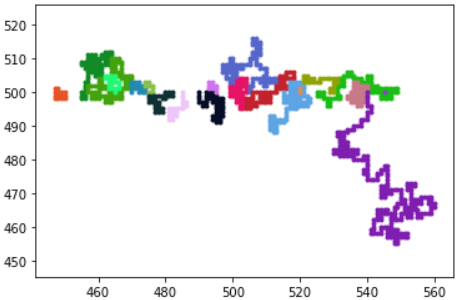
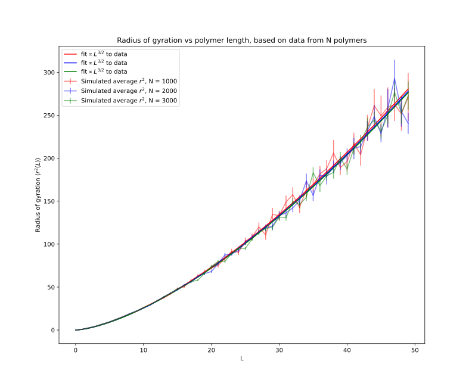

# Weekly progress journal

## Instructions

In this journal you will document your progress of the project, making use of weekly milestones. In contrast to project 1, you will need to define yourself detailed milestones.

Every week you should 

1. define **on Wednesday** detailed milestones for the week (according to the
   high-level milestones listed in the review issue).
   Then make a short plan of how you want to 
   reach these milestones. Think about how to distribute work in the group, 
   what pieces of code functionality need to be implemented. 
2. write about your progress **before** the Tuesday in the next week with
   respect to the milestones. Substantiate your progress with links to code,
   pictures or test results. Reflect on the relation to your original plan.

Note that there is a break before the deadline of the first week review
issue. Hence the definition of milestones and the plan for week 1 should be
done on or before 15 April.

We will give feedback on your progress on Tuesday before the following lecture. Consult the 
[grading scheme](https://computationalphysics.quantumtinkerer.tudelft.nl/proj2-grading/) 
for details how the journal enters your grade.

Note that the file format of the journal is *markdown*. This is a flexible and easy method of 
converting text to HTML. 
Documentation of the syntax of markdown can be found 
[here](https://docs.gitlab.com/ee/user/markdown.html#gfm-extends-standard-markdown). 
You will find how to include [links](https://docs.gitlab.com/ee/user/markdown.html#links) and 
[images](https://docs.gitlab.com/ee/user/markdown.html#images) particularly
useful.

## Week 1

We use Object Oriented Programming.

Our code makes a 'mesoscopic' model of the polymer. This week we prepare the basic starting code for the model. The model is made up of 'a chain consisting of beads: the beads represent segments of the polymer; the segments in turn represent groups of atoms.' The model is valid based on the idea of universality,
'only a few major features of the interactions at small length scales influence the
behaviour on longer length scales; the details do not matter'. (ref. section 10.6.1, paragraphs 1-3  https://compphys.quantumtinkerer.tudelft.nl/downloads/Thijssen_Chapter10_Monte_Carlo_Method.pdf)

The model is made up of N beads that are represented as point particles. The beads are placed on a square lattice so distances between adjacent beads are fixed to one dimensionless unit length and bonding angles are 90 degrees. We use Rosenbluth so we start with one bead and build our polymer as a self-avoiding random walk by adding next beads to the polymer. The vacant lattice points surrounding a bead are filled at random, with a restriction that no two beads can be placed on top of each other.

Files:
- The polymers grow on the square lattice given by WorldMap.py file.
- The file Polymer.py contains Polymer class definition. Polymer instance has attributes of size, initial position, step and color. The class methods are Walk (generates a path step for polymer growth), Update (it uses Walk to generate a new growth step and implements it if the step is valid e.g. no self-crossing etc. A new step is searched for until a valid step is found or no solution is found within given number of trails), Generate (which implements Update on all polymer beads), Plot (which displays the polymer on the image of a lattice)
- The file Ensemble.py contains definition of Ensemble class. Class attributes are size, initial position and umber of polymers. The class is created by assembling a given  number of Polymers with given initial positions and placing them on the WorldMap lattice.
- The file main.py contains the simulation code which uses other files mentioned above to generate the ensemble of polymers and grow them until they trap themselves or reach a maximum pre-set size.
A result of the code, with 20 polymers and max size of 1000 beads is presented below. Initial positions are chosen to cover a range of the lattice and give each polymer some space to grow.

 - The file Project2test.py is a trail used to develop the code ideas.
 - The code also has implemented the Rosenbluth method, here each polymer is given a weight dependent on the number lattice sites it can choose from each step. With this the average end-to-end distance is calculated in main.py.
 
Future improvements:
The polymer so far can trap itself if no vacant lattice points are available for growth. This problem will be dealt with at a later point. 
At a later point we will also extract physical quantities from our simulation.
In the following weeks we shall test the Rosenbluth method for longer polymers where the error is expected to become larger. The plan is to solve this by implementing the Pruned-enriched Rosenbluth method which can handle polymers with very large weights.

(due before 21 April)

## Week 2

A function that calculates end-to-end distance of the polymer was added to the Polymer class. It's used to calculate the average radius of gyration of the polymer. The code that calculates average radius of gyration (using end-to-end function) was added to the main.py file. Average radius of gyration is calculated as:
$`r_{gyration}=\frac{\sum_{k=1}^{N} w_k^{(L)} \times r^2_k(L)}{\sum_{k=1}^{N} w_k^{(L)}}`$
where $`w_k^{L}`$ is the weight of the polymer ('the reciprocals of the probabilities of the walks', ref: https://nvlpubs.nist.gov/nistpubs/jres/76B/jresv76Bn3-4p193_A1b.pdf) and $`r_k(L)`$ is the end-to-end length of the polymer.

A figure showing the dependence of the radius of gyration on length of the polymer was made and is shown below.
The errors associated with the radius of gyration were calculated as 'estimated standard deviation of the set' of radii of gyration of N polymers. (ref.https://compphys.quantumtinkerer.tudelft.nl/proj2-polymers/). The error forumla is:
$`r_{unc}= \sqrt{\frac{N}{N-1}\frac{\sum_{k=1}^{N} (w_k^{(L)})^2 \times (r^2_k(L)-\langle r^2(L) \rangle)^2}{(\sum_{k=1}^{N} (w_k^{(L)}))^2}}`$
The errorbars are included in the plot of $`r_{gyration}`$ vs $`L`$.
Our model predicts that radius of gyration is proportional to $`L^{3/2}`$. The curves are modelled as $`m \times L^{3/2}`$ ,where $`m`$ is a constant. The model is fitted to the data via orthogonal distance regression method, the proportionality constant $`m`$ is determined along with the standard deviation. The model is verified, indeed radius of gyration is proportional to $`L^{3/2}`$. The standard deviations of the fit parameter are of order $`O(10^{-3})`$ Visualisation of this:

Fit parameters for the modelled curves (in order of appearing in the legend), (for meaning of symbols look at the model):

        m =              [0.81783679 0.81015889 0.80570905]
        std_of_m =       [0.00431167 0.00407306 0.00425422]

(due before 28 April)

## Week 3

Link to the latex report: https://www.overleaf.com/read/qjfzvjskjtyb

(due before 5 May)

